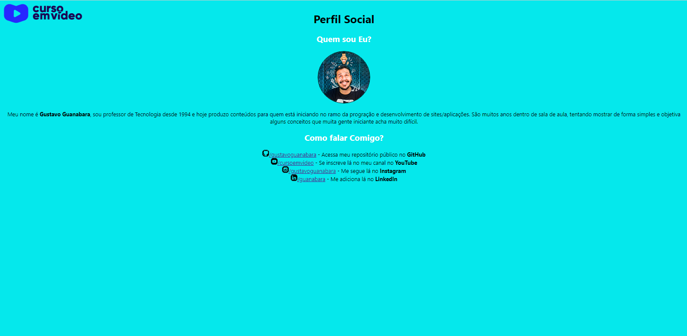

<h1 align="center">Curso em Video</h1>

 

 

# Tecnologias
Este projeto foi desenvolvido utilizando:
    
    
 
 

# Status do projeto
Finalizado (Versão Desktop): https://quintinopro.github.io/LPCursoVideo.github.io/

 

# Inspiração
Esta página de destino foi desenvolvida com o propósito de aprimorar meus conhecimentos em HTML/CSS.

 

